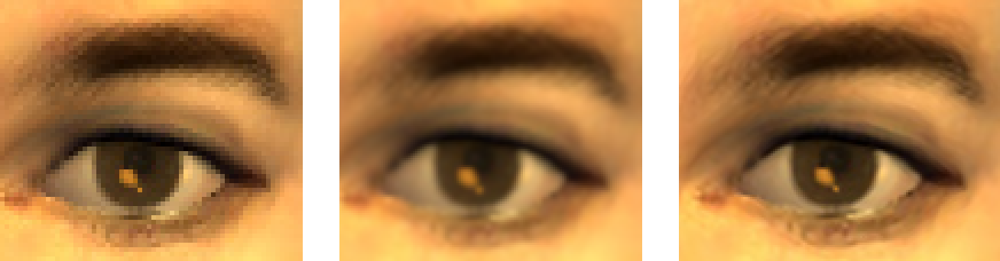

# rusty-raisr

This tool upscales images using Google's RAISR algorithm.

_TODO_: Finish the training part of the algorithm. Currently, this tool uses a filterbank that is exported from movehand's [Python implementation](https://github.com/movehand/raisr).

# Usage

```
USAGE:
    rusty_raisr [FLAGS] [OPTIONS] <input> <output>

FLAGS:
    -b               Benchmark GPU performance
    -g               Whether or not to use the GPU
    -h, --help       Prints help information
    -V, --version    Prints version information

OPTIONS:
    -d <FILE>        Name of filter image to write
    -f <FILE>        Filterbank to use [default: filters/filterbank]

ARGS:
    <input>     Input image
    <output>    Output image
```

The `-g` option uses an OpenGL compute shader to perform both the hashing and upsampling steps. You will need OpenGL 4.3 or higher. This backend is still a WIP -- there are a variety of small optimizations that I have not tried yet.

The "filter image" is a useful tool for visualizing which filter will be used per pixel. This feature does not work with the GPU backend.



(from left to right: nearest neighbor, bicubic, and RAISR)
